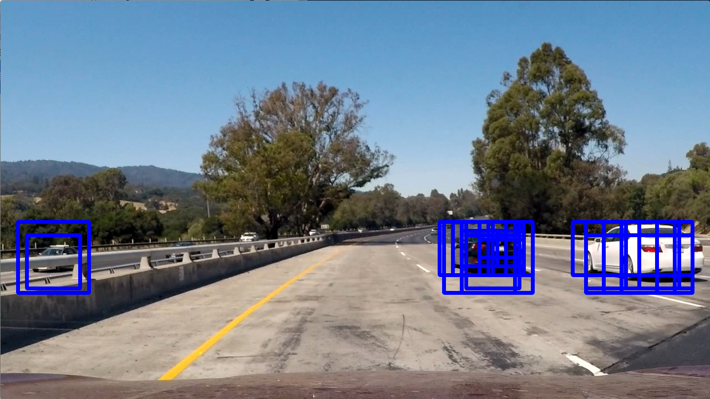
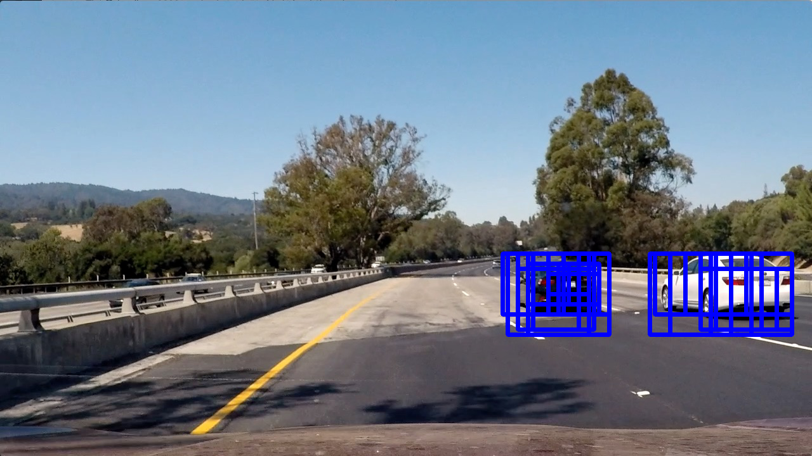
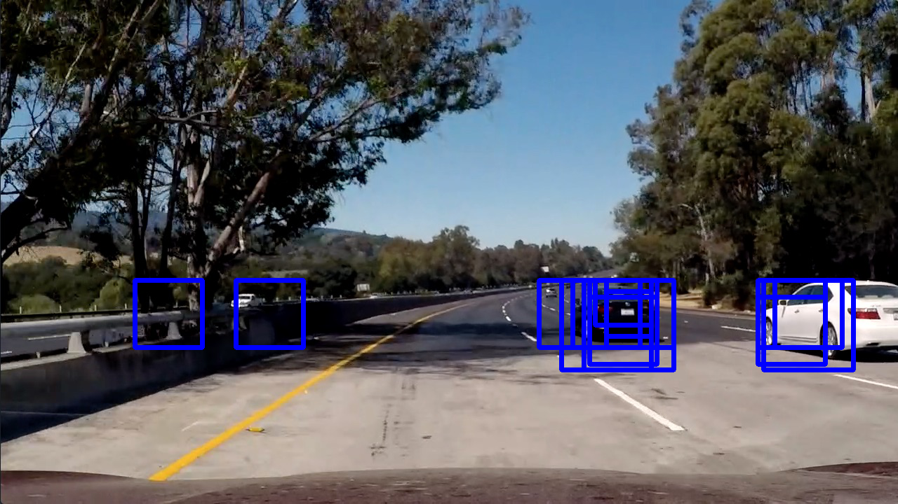
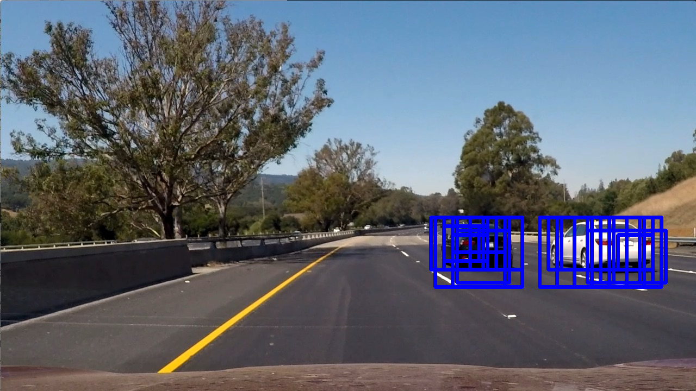

# Vehicle Detection
The goal of this project is to build a pipeline that detects cars in a video stream. I divide this task to 3 steps.

### Outline
__1. Training Classifier__  
__2. Sliding Window Search__  
__3. Video Pipeline__  

### Training Classifier
#### 1. Prepare Data
First, we need to build a classifier which classify car images and non-car images. The dataset consists of 8968 non-car images and 8792 car images.

#### 2. HOG Features
I extracted histogram of gradient features from the dataset. HOG features use gradients. But instead of using gradients of an image directely, it divides an image into many small sections, and computes a distribution of gradients' values of each section and concates all of such distributions together to get a final HOG features.

You can find the code in [feature.py](https://github.com/CreatCodeBuild/CarND-Vehicle-Detection/blob/master/feature.py)

Function `extract_hog_features(imgs, cspace='RGB', orient=9, pix_per_cell=8, cell_per_block=2, hog_channel=0)` implemented the HOG feature extraction. Although the default color space is RGB, I used YCrCb color space during the actual extraction.

#### 3. Color Features
HOG feature alone is not enough. I also used color features where are distributions of colors of an image.

Function `extract_color_features(imgs, cspace='RGB', spatial_size=(32, 32), hist_bins=32, hist_range=(0, 256))` in [feature.py](https://github.com/CreatCodeBuild/CarND-Vehicle-Detection/blob/master/feature.py) implemented color features extraction. I also used YCrCb color space.

#### 4. SVM Classifier

I used a simple Linear SVM classifier. In [classifier.py](https://github.com/CreatCodeBuild/CarND-Vehicle-Detection/blob/master/classifier.py), I implemented a class `Classifier`.

The configuration of this classifier is:
```
self.colorspace = 'YCrCb'  # Can be RGB, HSV, LUV, HLS, YUV, YCrCb
self.orient = 9
self.pix_per_cell = 8
self.cell_per_block = 2
self.hog_channel = "ALL"  # Can be 0, 1, 2, or "ALL"
self.spatial = 32
self.histbin = 32
```

In the `__init__` function, it first extract features from the dataset and then concatenated color features and HOG features. Then it normalized the concatednated feature vector.

They are implemented after line 41:
```
car_color_features = extract_color_features(self.cars, cspace=self.colorspace,
                                            spatial_size=(self.spatial, self.spatial),
                                            hist_bins=self.histbin, hist_range=(0, 256))
notcar_color_features = extract_color_features(self.notcars, cspace=self.colorspace,
                                               spatial_size=(self.spatial, self.spatial),
                                               hist_bins=self.histbin, hist_range=(0, 256))

print(round(t2 - t, 2), 'Seconds to extract color features...')

#
car_features = list(map(lambda x: np.concatenate(x), zip(car_color_features, car_hog_features)))
notcar_features = list(map(lambda x: np.concatenate(x), zip(notcar_color_features, notcar_hog_features)))

# Create an array stack of feature vectors
X = np.vstack((car_features, notcar_features)).astype(np.float64)
self.X_scaler = StandardScaler().fit(X)  # Fit a per-column scaler
scaled_X = self.X_scaler.transform(X)    # Apply the scaler to X
```

Then I simply split the dataset into 80% training and 20% testing and train and test the classifier.

I ran [classifier.py](https://github.com/CreatCodeBuild/CarND-Vehicle-Detection/blob/master/classifier.py) in terminal.

[classifier.py](https://github.com/CreatCodeBuild/CarND-Vehicle-Detection/blob/master/classifier.py) serialized the model into disk.
```
if __name__ == "__main__":
    with open("classifier.p", 'wb') as f:
        pickle.dump(Classifier(), f)
```

This is the training result:
```
102.65 Seconds to extract HOG features...
82.71 Seconds to extract color features...
Using: 9 orientations 8 pixels per cell and 2 cells per block
Feature vector length: 8460
396.68 Seconds to train SVC...
test score: 0.987331081081
```


### Sliding Window Search
#### 1. Hog Subsampling Window Search
Now I have a robust classifier. I need to implement a sliding window search on camera images so that the classifier can detect car at different locations.

To speed up the search, I used HOG subsampling window search. That is, instead of computes the HOG feature of a window during each step, I precomputed the hog features of the entire image, and then slide through this HOG feature image.

This is implemented in [search.py](https://github.com/CreatCodeBuild/CarND-Vehicle-Detection/blob/master/search.py).

`CarFinder` class implemented the details.

#### 2. Multi-scale Window Search
In order to detect cars of different sizes and distances. I used multiple windows sizes.

See:
```
if __name__ == "__main__":
    with open('classifier.p', 'rb') as f:
        classifier = pickle.load(f)
    finder = CarFinder()
    find_cars = finder.find_cars

    for path in glob.glob('test_images/*.jpg'):
        img = mpimg.imread(path)
        draw_img = np.copy(img)
        box_list = []
        out_img, _list = find_cars(img, draw_img, 1, classifier.svc, classifier.X_scaler, classifier.orient,
                            classifier.pix_per_cell, classifier.cell_per_block, classifier.spatial, classifier.histbin)
        box_list = box_list + _list

        out_img, _list = find_cars(img, draw_img, 1.5, classifier.svc, classifier.X_scaler, classifier.orient,
                            classifier.pix_per_cell, classifier.cell_per_block, classifier.spatial, classifier.histbin)
        box_list = box_list + _list

        out_img, _list = find_cars(img, draw_img, 2, classifier.svc, classifier.X_scaler, classifier.orient,
                            classifier.pix_per_cell, classifier.cell_per_block, classifier.spatial, classifier.histbin)
        box_list = box_list + _list

        mpimg.imsave("output_images/"+os.path.basename(path), out_img)

        draw_img, heatmap = heat_map(img, box_list)
        mpimg.imsave("output_images/" + "draw_" + os.path.basename(path), draw_img)
        mpimg.imsave("output_images/" + "heatmap_" + os.path.basename(path), heatmap)
```

The results images are like this:
  

Full images are in [output_images](https://github.com/CreatCodeBuild/CarND-Vehicle-Detection/blob/master/output_images)

#### 3. Remove False Positive
As you can see, sometimes the classifier "thoughts" non-car areas were cars. I used a heatmap technique to filter these areas out.

| Search Result        | Heat Map | Final Result  |
| ------------- |:-------------:|:-------------:|
||||
||||
||||
||||
||||
||||

As you can see, the heatmap has no "heat" at first. Whenever I saw a bounding box, I add a "heat" to the heatmap at the corresponding position. I then do a thresholding that only draw the final boundimg box at the areas where more heats are present.

This is impelemented by the `heat_map(image, box_list)` function in [search.py](https://github.com/CreatCodeBuild/CarND-Vehicle-Detection/blob/master/search.py)
 
### Video Pipeline
After successfully tested my algorithm with images, I wrote a video processing pipeline [pipeline.py](https://github.com/CreatCodeBuild/CarND-Vehicle-Detection/blob/master/pipeline.py)

Run it in the terminal:
```
python pipeline.py
```

It processes each frame of [project_video.mp4](https://github.com/CreatCodeBuild/CarND-Vehicle-Detection/blob/master/project_video.mp4) and produces the result [project_video_out.mp4](https://github.com/CreatCodeBuild/CarND-Vehicle-Detection/blob/master/project_video_out.mp4)


